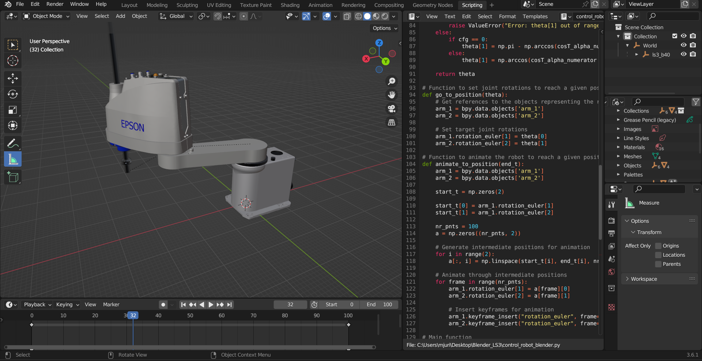

# Blender 2DOF SCARA LS3-B401C

As a part of VRM workshops, this project was carried out to demonstrate the use of Blender software and the implementation of the Inverse Kinematics solver. The main parts:

* Analytical Inverse Kinematics
* Denavit–Hartenberg Forward Kinematics
* Visualisation of the IK result
* Visualisation of the animation result - Linear Interpolation

Visualisation of the blender Scripting development environment:

 

:red_circle: Brno University of Technology,

:large_blue_circle: Faculty of Mechanical Engineering,

:computer: Institute of Automation and Computer Science
